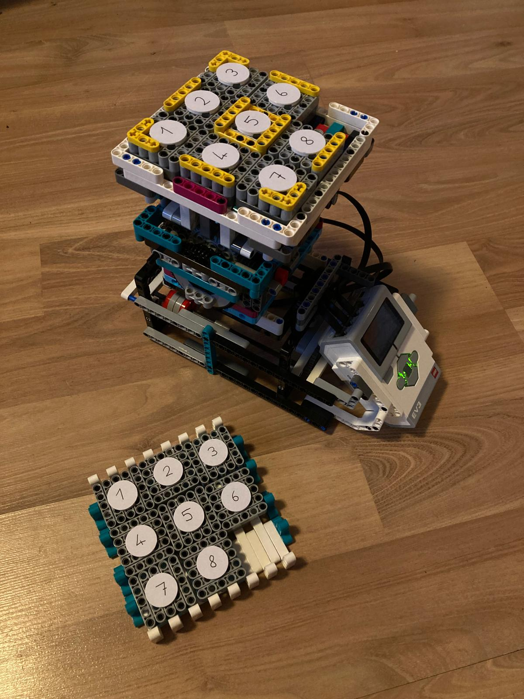
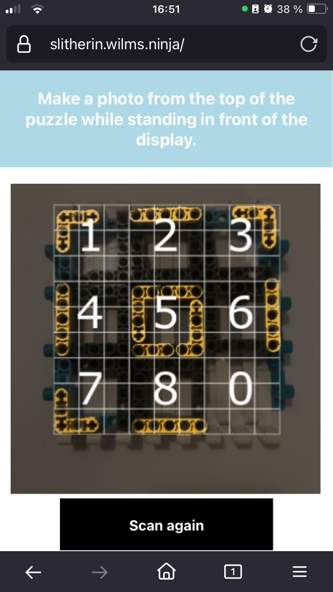

# Slitherin
## Sliding Puzzle Solver for LEGO Mindstorms

Solves a 3x3 sliding puzzle using a custom LEGO brick image detection and a motor control for LEGO Mindstorms EV3 - A HKA project work by Fabian Holfelder und Jonas Wilms.


Main ideas (you might want to steal):
- **A sliding puzzle solver** implemented in [Python](./robot/algorithm.py) and [Typescript](./controller/src/algorithm.ts) that finds the best solution for a 3x3 sliding puzzle in under 10 seconds (usually in a few milliseconds)
- **A handcrafted image detection for LEGO bricks in [300 lines of Typescript](./controller/src/pattern.ts)** which detects brick patterns by clustering yellow pixels (this is conceptually similar to a single-layer convolutional network)
- **Communication between the EV3 Motor Controller in Micropython and a Web-UI that can be run on any device** - by hosting a Webserver on the EV3 which can be opened on a device that is connected via Bluetooth + Tethering, and which communicates to the Micropython runtime via files
- A **[thousand piece Lego robot](./documentation/instructions_manual.pdf)** that solves a sliding puzzle by tilting the playing field ("the crown") while blocking tiles from moving by lifting up and down even and uneven fields ("the lifter")

| The robot     | The scanner        |
| ------------- |:-------------:|
|       |  |


## Installation

1. Build the Lego Robot following the **[instruction manual](./documentation/instructions_manual.pdf)** (you might also be interested in the [IO File](./documentation/instructions.io) for Bricklink Studio)
2. Check out this repository
3. Install VS Code with the "LEGO MINDSTORMS EV3 MicroPython" extension
4. Install [ev3-micropython](https://pybricks.com/ev3-micropython/startinstall.html) on the EV3 (we used V2.0.0)
5. Open the `/robot` folder of this repository in VSCode, connect the EV3 via USB, then connect the EV3 in the "Device Browser" tab and Download the folder to the EV3
6. Open an SSH Terminal on the EV3 to set up the Webserver on the EV3 by installing it as a SystemD Service:

```
cd ~/robot
sudo cp http_runner.service /etc/systemd/system/
sudo systemctl daemon-reload
sudo systemctl start http_runner
sudo systemctl enable http_runner
```

7. To setup scanning, copy `index.html` to a webserver and host it there (or use the variant hosted under https://slitherin.wilms.ninja) - it needs HTTPS to open the camera

## How to use

**Run Standalone without Scanning**

1. Use the Filebrowser on the EV3 to start the file `main_ev3.py` in the `robot` folder.
2. Select Calibrate Lifter in the menu, and adjust the lifter so that all tiles have the same height
3. Select Calibrate Axis and ensure the crown is in an upright position
4. Choose one of the modes - Random or Template - The robot will move into the shuffled state - Press Enter and the robot will search for a solution and apply it

While the robot is running, keep a button pressed to pause or abort - That way the robot halts in a good state and not in the middle of a move.

**Run with Scanning**

Setup the device and the EV3:
1. Connect any device via Bluetooth to the EV3 (enable Bluetooth in the settings) - preferrably a mobile device (iPhone worked well)
2. Enable Tethering on the EV3 and on the device (on iOS this is enabled per default) so that the EV3 gets an IP address under which the webserver on the device is reachable
3. Go to https://slitherin.wilms.ninja or your hosted website, select "Set Address" and type in the ip address of the EV3
4. Start the motor control as described in the previous section, then choose "Connect" - Now the motor control will listen to commands coming from the webserver

Start the game:
1. Scramble the pattern on the EV3 - Best not to take tiles out as that could cause an unsolvable pattern
2. Scan the pattern using the device - This will open the camera, hold the device centered on top of the playing field. As the scanning detects the yellow pieces, avoid having other yellow things around and ensure that the lighting is good. In case of doubt, click "Scan now" to see what the scanner (wrongfully) detected. Also the scanning must be done in the orientation of the numbers.
3. Once the scanner found a pattern, check whether it is correct (it usually is) then click "Start"
4. This will now search for the shortest solution to solve the pattern - As it is run on the mobile device and not on the EV3 this finishes much faster, usually in milliseconds (even going through all possible pathes takes only about 10 seconds). If the pattern is unsolvable, the algorithm won't find a solution and the pattern needs to be changed - then reload and go back to step 1.
4. The browser is redirected from the website (running under HTTPS to open the camera) to the website hosted on the EV3 (to control the motors) - depending on the stability of the Bluetooth connection, this might load a few seconds
5. If a competing player is ready, press "Start Game" - This will send a command to the webserver, which will write the command into a file where the motor control will pick it up and start applying the solution
6. The website should show the movements in "real time" (with some delay) - depending on the stability of the bluetooth connection

## How to develop

**On the robot**

The `/robot` folder contains a micro-python program to control a LEGO Mindstorms EV3. To run it on an EV3 with the debugger attached, install the "LEGO MINDSTORMS EV3 MicroPython" extension in VS Code, open `main_ev3.py` and "Run on EV3" from the Debugger tab. Alternatively to develop the algorithm, `main_standalone.py` can also be used to run it from a terminal program. Run `test.py` to run some small unit tests. The main algorithm is contained in `algorithm.py`, `ui.py` contains the generic UI around it - which is then hooked in by `main_ev3.py` which implements the motor control and webserver connection. `http_runner.py` contains the webserver which hosts the website for controlling the robot, by reading + writing files that the motor controller will pick up.

**The controller**

The user interface on the controlling device is implemented as a React Web App in the `/controller` folder. To develop it, install NodeJS + NPM, then run `npm ci`to install dependencies, then run `npm start` for interactive development. Run `npm run build` to build the index.html file into the build folder - then copy that to the robot. The user interface consists of two parts - the image scanner which is implemented in the `<ScannerApp/>` - this is the UI one opens on the webserver with HTTPS, as a secure context is mandatory to open the camera. The main image detection logic can be found in `pattern.ts`, `algorithm.ts` contains a port of the sliding puzzle solver. Once the user is redirected to the version hosted on the EV3 - where the scanned puzzle and the solution are passed on as query parameters - the `<ControllerApp/>` which then communicates with the webserver using `controller.ts`.

The image detection first filters out all yellow pixels, then builds a bounding box that contains all yellow pixels. This is then split in 3x3 areas that should contain the different tiles, each is then split into 3x3 "superpixels" in which the yellow pixels are aggregated. The superpixels are then matched against patterns of the different tiles.
